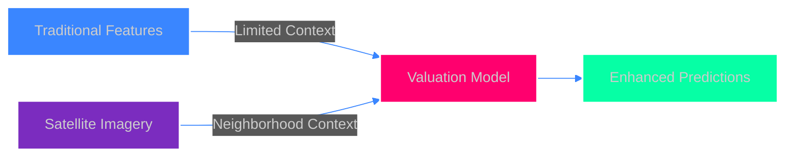
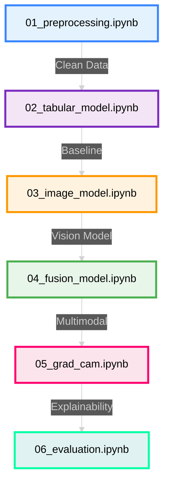

<div align="center">

<!-- Animated Header -->


<!-- Hero Badges -->
<p>
  
  
  
  
</p>

**🛰️ A multimodal machine learning project exploring how satellite imagery complements traditional housing data for property price prediction**

[Features](#-problem-overview) • [Approach](#-project-approach) • [Models](#-models-implemented) • [Setup](#-how-to-set-up-the-project) • [Findings](#-key-findings)

---

</div>

## 🌟 Overview

This project builds an end-to-end **real estate valuation pipeline** that combines:

<table>
<tr>
<td width="50%" valign="top">

### 📊 Structured Data
- Living area & lot size
- Number of bedrooms/bathrooms
- Construction quality metrics
- Geographic coordinates

</td>
<td width="50%" valign="top">

### 🗺️ Visual Context
- Green cover density
- Water body proximity
- Road connectivity patterns
- Urban layout features

</td>
</tr>
</table>

<div align="center">

> **Goal:** Understanding whether and how visual context adds value to property valuation

</div>

---

## 🔍 Problem Overview

<div align="center">



</div>

Traditional real estate valuation models rely heavily on structured attributes such as:

- ✅ Living area
- ✅ Number of bedrooms and bathrooms
- ✅ Construction quality
- ✅ Geographic coordinates

However, these features often fail to capture **neighborhood-level context**, such as:

- 🌊 Presence of water bodies
- 🌳 Green spaces vs concrete density
- 🛣️ Road connectivity and urban layout

<div align="center">

### 💡 Research Question

> **Can satellite imagery improve property valuation when combined with tabular data?**

</div>

---

## 🧠 Project Approach

We follow a **multimodal regression pipeline**:

<div align="center">

```
┌─────────────────────────────────────────────────────────────────┐
│                      📍 Property Location                        │
│                    (Latitude / Longitude)                        │
└──────────────────────────────┬──────────────────────────────────┘
                               │
                ┌──────────────┴──────────────┐
                │                             │
                ▼                             ▼
     ┌─────────────────────┐       ┌──────────────────────┐
     │   🛰️ Satellite API   │       │  📋 Tabular Features │
     │  Image Acquisition   │       │   • Sqft             │
     └──────────┬───────────┘       │   • Beds/Baths       │
                │                   │   • Quality          │
                ▼                   │   • Year Built       │
     ┌─────────────────────┐       └──────────┬───────────┘
     │  🧠 CNN (ResNet18)   │                  │
     │  Image Embeddings    │                  │
     │     (512-dim)        │                  │
     └──────────┬───────────┘                  │
                │                              │
                └──────────────┬───────────────┘
                               │
                               ▼
                    ┌─────────────────────┐
                    │  🔗 Fusion Module   │
                    │  Multimodal ML      │
                    └──────────┬──────────┘
                               │
                               ▼
                        💰 Price Prediction
```

</div>

---

## 📂 Repository Structure

```
satellite-property-valuation/
│
├── 📁 data/
│   ├── raw/                    # Original train & test datasets
│   ├── processed/              # Cleaned CSVs, aligned subsets
│   └── images/                 # Satellite images (NOT committed)
│
├── 📓 notebooks/
│   ├── 01_preprocessing.ipynb        # 🧹 Data cleaning & EDA
│   ├── 02_tabular_model.ipynb        # 📊 Baseline model
│   ├── 03_image_model.ipynb          # 🖼️ Image-only model
│   ├── 04_fusion_model.ipynb         # 🔗 Multimodal fusion
│   ├── 05_grad_cam.ipynb             # 👁️ Explainability
│   └── 06_evaluation.ipynb           # 📈 Final comparison
│
├── 🐍 src/
│   └── data_fetcher.py         # Satellite image acquisition script
│
├── 📤 outputs/
│   └── predictions.csv         # Final test predictions
│
├── 📋 requirements.txt
├── 📖 README.md
└── 🚫 .gitignore
```

---

## 🧪 Models Implemented

<div align="center">

<table>
<tr>
<td width="33%" align="center">


### 1️⃣ **Strong Baseline**

Uses structured housing features only with traditional regression models

✅ Strong performance  
✅ Interpretable  
✅ Fast training  

**🥇 WINNER**

</td>
<td width="33%" align="center">


### 2️⃣ **Vision Model**

Satellite images → ResNet18 embeddings

⚠️ Some signal  
⚠️ Noisy predictions  
⚠️ Needs context  

**🔴 NOISY**

</td>
<td width="33%" align="center">


### 3️⃣ **Fusion Model**

Early fusion of tabular + image embeddings

❓ Explores improvements  
❓ Critical analysis  
❓ Honest evaluation  

**🟡 DID NOT IMPROVE**

</td>
</tr>
</table>

</div>

---

## 📊 Key Findings

<div align="center">

| Model | RMSE | R² | Performance |
|:------|:----:|:--:|:-----------:|
| **Tabular Only** | ⭐ Best | ⭐ High | 🥇 Winner |
| **Image Only** | ⚠️ Weak | ⚠️ Negative | 🔴 Noisy |
| **Multimodal Fusion** | ⬇️ Lower | ⬇️ Lower | 🟡 Did not improve |

</div>

### 🔑 Key Takeaway

> **Structured tabular features provide the strongest predictive signal for property valuation.**
> 
> Satellite imagery captures meaningful neighborhood-level context (greenery, water, roads), but naïve fusion with high-dimensional image embeddings can introduce noise and does not consistently improve predictive performance.

**This highlights the need for selective or attention-based fusion strategies in real-world multimodal systems.**

---

## 👁️ Explainability with Grad-CAM

To understand *what the CNN looks at*, we apply **Grad-CAM** on satellite images.

<div align="center">

```
╔══════════════════════════════════════════════════════════════╗
║                     🔥 ACTIVATION PATTERNS                    ║
╠══════════════════════════════════════════════════════════════╣
║                                                              ║
║  💎 HIGH-VALUE HOMES          │  🏚️ LOW-VALUE HOMES          ║
║  ─────────────────────────    │  ─────────────────────────   ║
║  ✅ Water bodies              │  ❌ Dense rooftops           ║
║  ✅ Green spaces              │  ❌ Concrete-heavy regions   ║
║  ✅ Open layouts              │  ❌ Industrial textures      ║
║  ✅ Road access               │  ❌ Poor connectivity        ║
║                                                              ║
╚══════════════════════════════════════════════════════════════╝
```

</div>

**Validation:** Satellite imagery captures **semantically meaningful spatial cues**, even when it does not directly improve regression metrics.

---

## 🚀 How to Set Up the Project

### 1️⃣ Clone the Repository

```bash
git clone https://github.com/yourusername/satellite-property-valuation.git
cd satellite-property-valuation
```

### 2️⃣ Create Virtual Environment

```bash
# Mac/Linux
python -m venv venv
source venv/bin/activate

# Windows
python -m venv venv
venv\Scripts\activate
```

### 3️⃣ Install Dependencies

```bash
pip install -r requirements.txt
```

### 4️⃣ Set API Key (Mapbox)

Create a `.env` file in the project root:

```env
MAPBOX_TOKEN=your_mapbox_api_key_here
```

### 🛰️ Download Satellite Images (Optional)

Satellite images are not included due to size and API constraints. To download them:

```bash
python src/data_fetcher.py
```

This will fetch satellite images for a stratified subset of properties.

---

## ▶️ Running the Project

<div align="center">

### 📘 Recommended Execution Order

</div>



<table>
<tr>
<th>Notebook</th>
<th>Purpose</th>
<th>Output</th>
</tr>
<tr>
<td><code>01_preprocessing.ipynb</code></td>
<td>🧹 Data cleaning & EDA</td>
<td>Cleaned datasets</td>
</tr>
<tr>
<td><code>02_tabular_model.ipynb</code></td>
<td>📊 Baseline model</td>
<td>Performance metrics</td>
</tr>
<tr>
<td><code>03_image_model.ipynb</code></td>
<td>🖼️ Image-only model</td>
<td>CNN embeddings</td>
</tr>
<tr>
<td><code>04_fusion_model.ipynb</code></td>
<td>🔗 Multimodal fusion</td>
<td>Combined predictions</td>
</tr>
<tr>
<td><code>05_grad_cam.ipynb</code></td>
<td>👁️ Explainability</td>
<td>Activation maps</td>
</tr>
<tr>
<td><code>06_evaluation.ipynb</code></td>
<td>📈 Final comparison</td>
<td>Model rankings</td>
</tr>
</table>

---

## 📄 Generating Final Predictions

Final predictions on the test dataset are generated using the **best-performing tabular model**:

```
outputs/predictions.csv
```

**Format:**
```csv
id,predicted_price
1,285000
2,342000
...
```

---

## ⚠️ Notes & Limitations

<table>
<tr>
<td width="33%" align="center">

### 🎯
Satellite imagery is treated as a **complementary signal**, not a replacement

</td>
<td width="33%" align="center">

### 🔬
Naïve fusion can degrade performance due to noisy high-dimensional features

</td>
<td width="33%" align="center">

### 🚀
Advanced fusion methods (attention, gating, late fusion) are proposed as future work

</td>
</tr>
</table>

---

## 🔮 Future Improvements

<div align="center">

| Enhancement | Impact | Status |
|:------------|:------:|:------:|
| 🎯 Attention-based multimodal fusion | 🔥 High | 🔵 In Progress |
| 🔄 Late fusion of predictions | ⭐ Medium | 🔵 In Progress |
| ⏱️ Temporal satellite imagery | 🔥 High | ⚪ Planned |
| 📈 Socioeconomic context integration | ⭐ Medium | ⚪ Planned |
| 🏗️ Architecture search (NAS) | 🌟 Low | ⚫ Research |
| 🗺️ Multi-scale spatial features | 🔥 High | ⚫ Research |

**Legend:** 🔵 In Progress • ⚪ Planned • ⚫ Research Phase

</div>

---

## 🏁 Final Remarks

<div align="center">

**This project emphasizes engineering discipline, experimental rigor, and honest analysis over chasing marginal metric gains.**

### It demonstrates:

</div>

<table>
<tr>
<td width="25%" align="center">

### ⚙️
**End-to-end ML system design**

</td>
<td width="25%" align="center">

### 🔗
**Multimodal data handling**

</td>
<td width="25%" align="center">

### 🔍
**Explainability & interpretability**

</td>
<td width="25%" align="center">

### 📊
**Critical evaluation of results**

</td>
</tr>
</table>

---

<div align="center">

### 📫 Questions or Feedback?

Open an issue or reach out!

**Made with 🛰️ and 🧠**

<p>
  <a href="https://github.com/yourusername/satellite-property-valuation">
    
  </a>
  <a href="https://github.com/yourusername/satellite-property-valuation">
    
  </a>
  <a href="LICENSE">
    
  </a>
</p>


</div>
